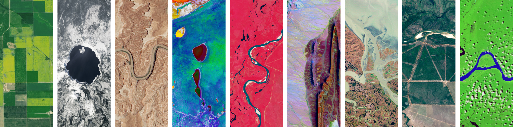
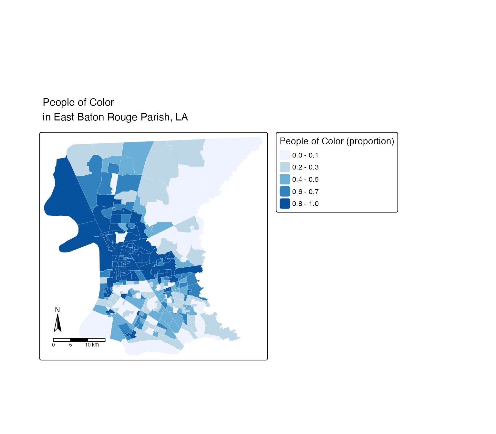
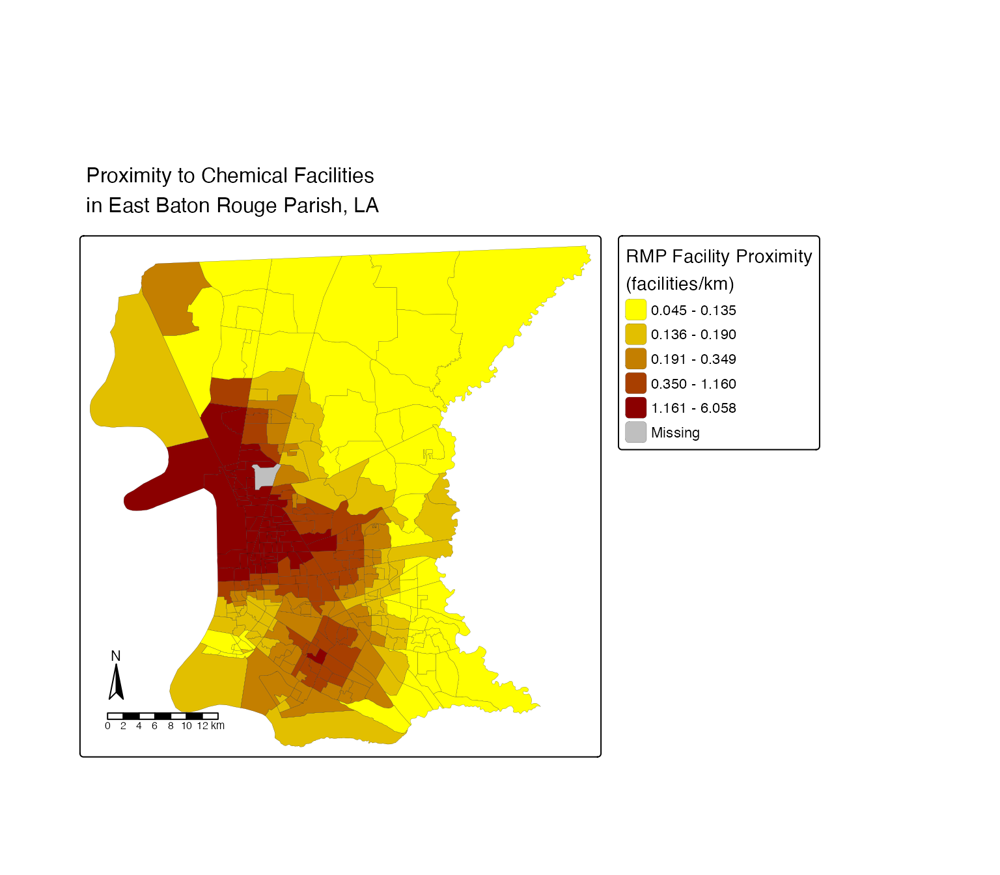

# Geospatial Analysis of Various Environmental Inequities in East Baton Rouge Parish, Louisiana




<p align="center">
<a href="https://science.nasa.gov/mission/landsat/">Your Name in Landsat</a>
</p>


### Purpose of this Repository

This repository contains Homework 1 for EDS 223: Geospatial Analysis & Remote Sensing. It uses the EPA's National EJScreen data at the Census block group level to map environmental justice concerns. In order to run the analysis and reduce computational load, the data was filtered to East Baton Rouge Parish, Louisiana. The goal is to build accessible, single-layered maps in R with `tmap` that show how environmental burdens are distributed across communities in the county.


### Package Dependencies

* `tidyverse` 

* `fs`

* `here`

* `tmap`


## File Structure 

```
EDS223-HW1
├── data
│   └── ejscreen
├── ej_screen.pdf
├── ej_screen.qmd
├── images
│   ├── image1.png
│   ├── image2.png
│   └── LA.png
└── README.md

```


### Repository Contents

The `data` folder contains the data used for this analysis. 


The `images` folder contains images that were used for the README and results section.


## Results 






### Data Information/Access

The data used for this analysis was from the United States Environmental Protection Agency’s previous EJScreen: Environmental Justice Screening and Mapping Tool found [here](https://www.epa.gov/ejscreen).

The tool, when in existence, was intended to support research and policy goals. It was shared with the public to be more transparent about how we consider environmental justice in our work and to assist  stakeholders in making informed decisions about pursuing environmental justice.

While the original tool is no longer available, an unofficial version can be found [here](https://pedp-ejscreen.azurewebsites.net/).


### Authors and Contributors

Author: [Ethan Mathews](https://github.com/ethan-mathews24) 

Contributor: [Annie Adams](https://github.com/annieradams)


### Citations 

#### Data Citation 
Public Environmental Data Partners. *EJScreen: Environmental Justice Screening and Mapping Tool*. Originally developed by U.S. Environmental Protection Agency, 2025, pedp-ejscreen.azurewebsites.net/. Accessed 02 October 2026.


#### Result Citation
Environmental Protection Agency. (2026, August 3). *Risk Management Program (RMP) Rule*. EPA. https://www.epa.gov/rmp 


