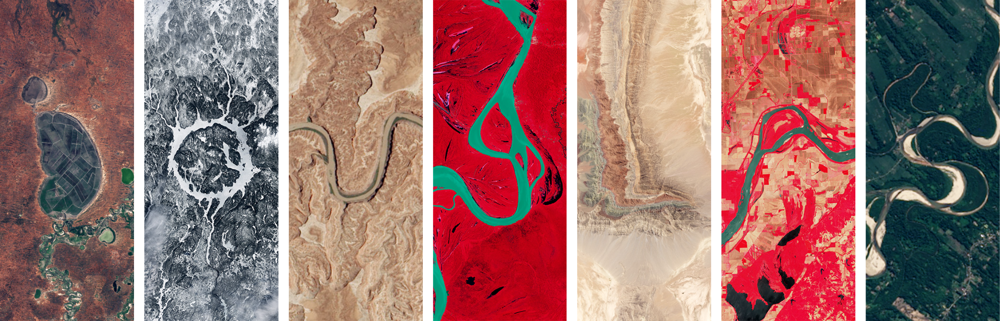

# Geospatial Analysis of Various Environmental Inequities in Douglas County, Nebraska




<p align="center">
<a href="https://science.nasa.gov/mission/landsat/">Your Name in Landsat</a>
</p>


### Purpose of this Repository

This repository is for the Homework #01 assignment for EDS223 (MEDS-Fall2026).


### Package Dependencies

* `tidyverse` 

* `fs`

* `here`


## File Structure 

`run tree`

paste below
```


```


### Repository Contents

The [`data`](data/) folder contains...


The [`image`](images/) folder contains...


## Results 


INFO:


INFO:


### Data Information/Access

The data used for this analysis was from the United States Environmental Protection Agency’s previous [EJScreen: Environmental Justice Screening and Mapping Tool](https://www.epa.gov/ejscreen).

The tool, when in existence, was intended to support research and policy goals. It was shared with the public to be more transparent about how we consider environmental justice in our work, to assist  stakeholders in making informed decisions about pursuing environmental justice, and to create a common starting point between the agency and the public when looking at issues related to environmental justice.

While the original tool is no longer available, an unofficial version can be found [here](https://pedp-ejscreen.azurewebsites.net/).


### Authors and Contributors

Author: [Ethan Mathews](https://github.com/ethan-mathews24) 

Contributor: [Annie Adams](https://github.com/annieradams)


### Acknowledgements


